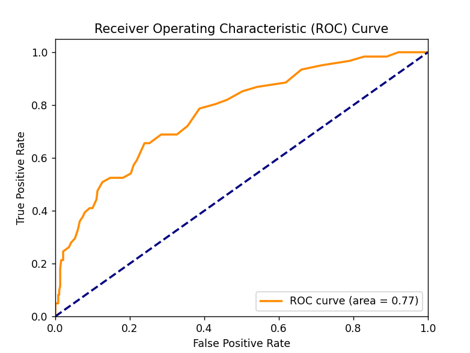

# Employee Attrition Prediction

## Overview

This machine learning project aims to predict employee attrition using data from IBM. The project utilizes three different models to analyze the data and make predictions:

1. Decision Tree Classifier
2. Random Forest Classifier
3. Logistic Regression

The performance of these models is evaluated using the Receiver Operating Characteristic (ROC) curve, which plots the True Positive Rate (TPR) against the False Positive Rate (FPR).

## Dataset

The project uses an IBM dataset containing various employee attributes and their attrition status. The dataset includes features such as age, job role, years at the company, and other relevant factors that might influence an employee's decision to leave.

## Models

### Decision Tree Classifier

A tree-structured model that makes decisions based on asking a series of questions about the input features.

### Random Forest Classifier

An ensemble learning method that constructs multiple decision trees and combines their outputs to make predictions.

### Logistic Regression

A statistical model that estimates the probability of an event occurring based on given independent variables.

## Evaluation

The models are evaluated using the ROC curve, which illustrates the diagnostic ability of the binary classifiers. The Area Under the Curve (AUC) is used to quantify the overall performance of each model.

## Results

ROC Curve



The ROC curve plot shows the performance of each model in distinguishing between employees likely to leave and those likely to stay. A curve closer to the top-left corner indicates better performance.

## Interpretation

-   True Positive Rate (TPR): The proportion of actual positive cases (employees who left) that were correctly identified.
-   False Positive Rate (FPR): The proportion of actual negative cases (employees who stayed) that were incorrectly identified as positive.

A higher TPR and lower FPR indicate better model performance.

## Installation and Usage

1. Clone the repository:

```
git clone https://github.com/VivekChaurasia03/Employee-Attrition-Prediction.git
cd Employee-Attrition-Prediction
```

2. Install the required dependencies:

```
pip install -r requirements.txt
```

3. Run the main script to train the models and generate the ROC curve:

```
python main.py
```

## Contributing

Contributions to improve the project are welcome. Please feel free to submit a Pull Request.
